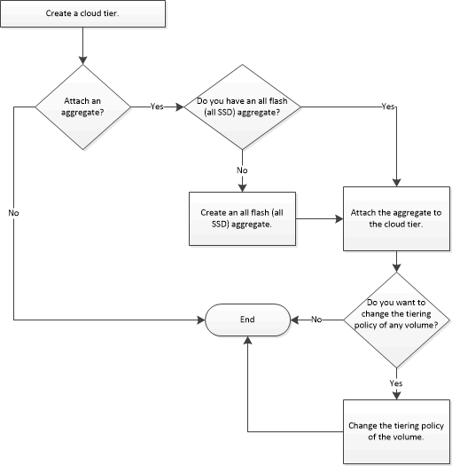

= 클라우드 계층 구성 및 관리
:icons: font
:imagesdir: ../media/

[role="lead"]
데이터를 계층에 저장하면 스토리지 시스템의 효율성이 향상됩니다. FabricPool 지원 애그리게이트를 사용하여 스토리지 계층을 관리할 수 있습니다. 클라우드 계층은 데이터 액세스 빈도 여부에 따라 데이터를 계층에 저장합니다.

.시작하기 전에
* ONTAP 9.2 이상을 실행해야 합니다.
* 모든 플래시(All SSD) 애그리게이트가 있어야 합니다

